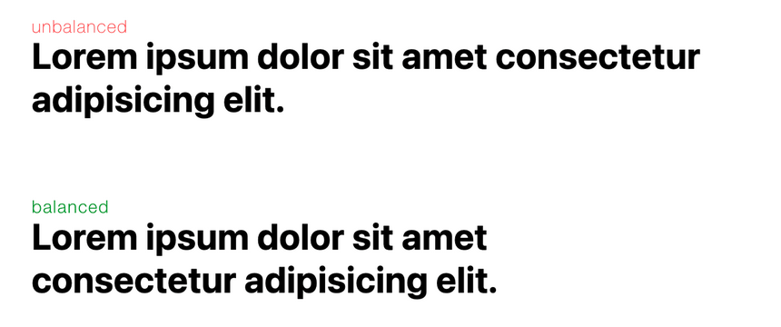
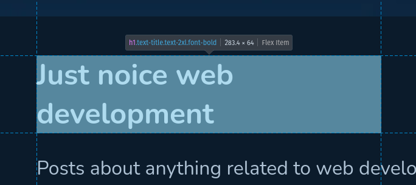

Have you ever wondered how to make your headings look better?

Well there is actually a very simple solution. There is an option for the text-wrap property named **balanced**. In my opinion it works great with headings! Below is how you would use it on _h1_ elements.

```css
h1 {
  text-wrap: balance;
}
```

Or if you prefer to use tailwindcss then like so.

```html
<h1 class="text-balance">My Heading</h1>
```

## But what does it do?

It wraps text in such a way that it balances the number of characters on each line. This improves legibility and the quality of the layout. Or in other words, it makes your text look **NOICE**.



## Any gotchas?

Well, nothing is ever free, they say. In this case the cost is related to performance. It requires additional computation to count the characters and then work out how to balance the length over multiple lines. As a result, at the time of writing, **balance** is only supported on blocks of text spanning 6 or less lines in **Chrome** and 10 or less lines in **Firefox**. Hence why this is a good choice for headings.

The **white-space** property can also compete with the **text-wrap** property. If we are trying to have text wrap in a balanced way then unsetting the white-space property is a good idea.

```css
.balanced {
  white-space: unset;
  text-wrap: balance;
}
```

Another thing to note is that the inline size of the element won't change when using **text-wrap: balance**. As can be seen in the screenshot below, the width of the heading is still the same even though the text is wrapped and doesn't use the full width.



## That's it

There you go, a simple but effective way to make your headings look **NOICE** by making use of a single CSS property.
